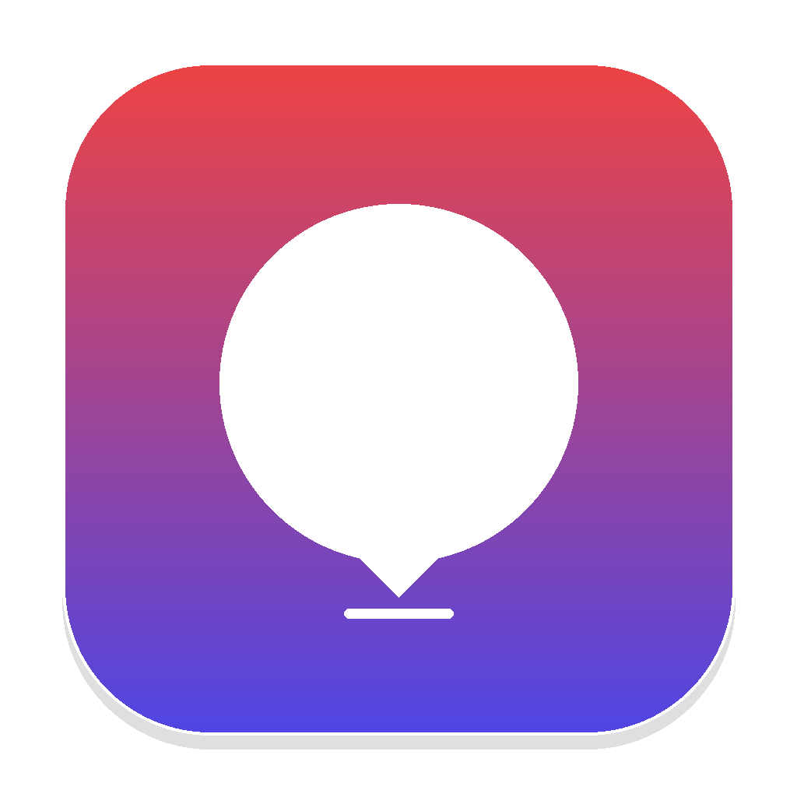

# Mazekty Pro 🎵 (مزيكتي برو)
### Offline High-Resolution Audio Downloader, Pro Studio & Apple/iPhone Sync Engine

  

### 📥 [Download Mazekty Pro v1.0.0 for macOS, Windows & Linux](https://github.com/AlAhmedElHamed/Mazekty/releases/latest)

Mazekty is a cross-platform (macOS, Windows, Linux) desktop music application designed for downloading high-fidelity audio from YouTube, live searching, audio manipulation (vocal isolation, karaoke creation, pitch/tempo shifting, 8D spatial audio, 10-band graphic EQ, silence cutting, ringtone creator), and seamless syncing with **Apple Music** and **iPhones / mobile devices** (via **AirSync QR Code** & **USB Type-C auto-detection**).

**100% Local & Offline — Zero external API keys, zero subscriptions, zero tracking.**

---

## 🌍 Multilingual Support (8 Languages)
Mazekty defaults to **English** and provides real-time instant localization across 8 major languages:
- 🇺🇸 **English** (Default)
- 🇸🇦 **العربية** (Arabic)
- 🇪🇸 **Español** (Spanish)
- 🇫🇷 **Français** (French)
- 🇩🇪 **Deutsch** (German)
- 🇹🇷 **Türkçe** (Turkish)
- 🇧🇷 **Português** (Portuguese)
- 🇷🇺 **Русский** (Russian)

---

## 🚀 Key Features

### 🆓 Free Tier (10 Core Features):
1. **Multi-Format Downloads**: High-res MP3 (320kbps, 256kbps, 192kbps, 128kbps), M4A, FLAC, WAV, and MP4 Video.
2. **Bandwidth Limiter**: Cap download speeds (Unlimited, 500 KB/s, 1 MB/s, 3 MB/s) to preserve network traffic.
3. **Queue Manager**: Full control to pause, resume, and cancel individual items or batch operations.
4. **Smart Clipboard Detector**: Instant 1-click URL pasting and detection.
5. **Playlist Range Selector**: Select specific track indices or custom ranges (e.g., tracks 1-15).
6. **ID3 Metadata Editor**: Edit Title, Artist, Album, Year, and Genre directly in the app.
7. **Volume Boost (+6dB)**: 1-click lossless volume booster for quiet tracks.
8. **Export to M3U Playlists**: Export any folder or selection into standard `.m3u` playlists compatible with VLC and car stereos.
9. **Library Search & Sorting**: Fast client-side filtering and sorting by Newest, Oldest, Name, or File Size.
10. **Theme & Accent Customization**: Dark Glass, OLED Black, and Light Modern modes with 5 vibrant neon accents.

### 👑 Pro Studio (10 Pro Audio Engineering Tools - 100% Local):
1. **Vocal Remover & Karaoke Maker**: Out-of-phase stereo vocal cancellation engine to isolate instruments.
2. **Pitch & BPM Shifter**: Transpose audio (-6 to +6 semitones) and adjust playback speed (0.5x to 1.8x).
3. **8D Spatial Audio**: 360-degree rotating binaural surround sound effect for headphones.
4. **10-Band Graphic Equalizer**: Studio presets including Bass Boost, Vocal Clarity, Rock, Electronic, and Podcast.
5. **Smart Silence Trimmer**: Auto-detects and removes dead air from audio beginnings and endings.
6. **Batch Format Converter**: Convert entire folders of audio files in one click.
7. **Album Art Injector**: Embed custom cover artwork permanently into audio ID3 tags.
8. **Lyrics & Subtitle Extractor**: Downloads synchronized YouTube subtitles and transcripts.
9. **Scheduled Download Timer**: Set automated downloads to trigger after a custom delay.
10. **Direct Apple Music Sync**: 1-click integration with macOS Apple Music library and Windows/Linux Music folders.

---

## 📱 Dedicated Apple & Mobile Sync Tab (AirSync & USB Type-C)

- **AirSync (WiFi / QR Code)**:
  - Generates a local QR code with direct IP link.
  - Scan with your iPhone Camera or Android device to instantly open the mobile-optimized player.
  - Download songs directly to your iPhone's **Files / Safari Downloads** and listen on the go.
- **iPhone USB Type-C Auto-Detection**:
  - Automatically queries Apple `usbmuxd` and macOS `system_profiler` / Windows USB enumerators.
  - Instantly detects connected iPhones and prompts 1-click sync into Apple Music playlists.
- **Custom Playlist Creation**:
  - Create custom playlists (e.g. *Gym Hits*, *Roadtrip 2026*) and sync selected songs directly into named Apple Music playlists.

---

## 💻 Installation & Platforms

###  macOS:
- Open `build/mac/Mazekty Installer.dmg`
- Drag **Mazekty** to your **Applications** folder.
- Run as a native macOS window!

### 🪟 Windows:
- Unzip `build/windows/Mazekty-Windows-Portable.zip`
- Double-click `start_windows.bat` to launch immediately.
- Optional: Use `installer_windows.iss` with Inno Setup to create a standard Windows setup `.exe`.

### 🐧 Linux:
- Extract `build/linux/Mazekty-Linux-Portable.tar.gz`
- Run `./install_linux.sh` to install desktop shortcut, or run `./start_linux.sh` directly.

---

## 🛠 Tech Stack
- **Backend**: Python 3, Flask, yt-dlp, FFmpeg, Mutagen
- **Frontend**: Vanilla JS (ES6+), HTML5, Modern CSS Glassmorphism
- **Native Shells**: macOS `pywebview` / WebKit native cocoa window

---

## 📄 License
Released under the [MIT License](LICENSE).
